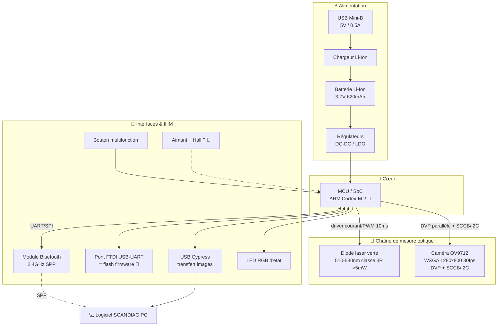
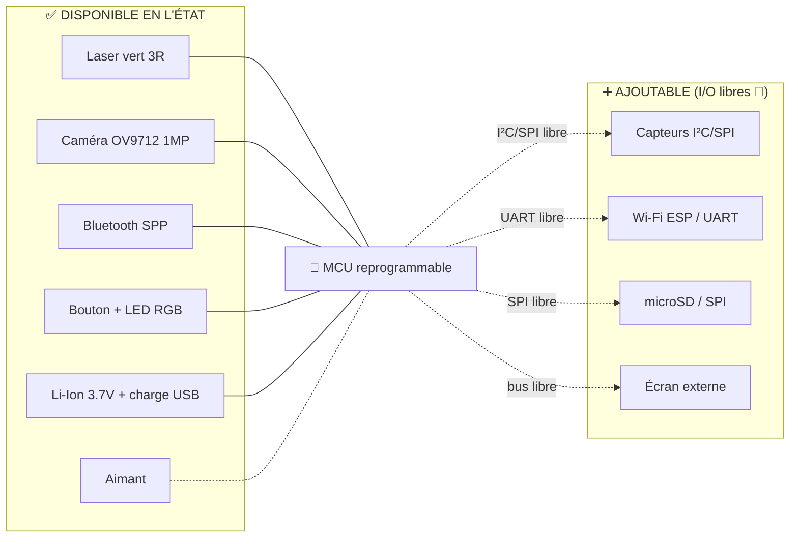

# Dossier de Rétro-ingénierie — FACOM SCANDIAG® `DX.TSCANPB`
### Concours National Informatique Ynov × FACOM (Stanley Black & Decker) — Réemploi RSE

> **Phases 1 & 2** — Rétro-ingénierie fonctionnelle + Cartographie du champ des possibles
> Document destiné à la Direction RSE de FACOM.

---

## 0. Synthèse exécutive

Le **SCANDIAG® `DX.TSCANPB`** est un **analyseur portatif de disques de frein et de pneus**
en forme de stylo, fabriqué par l'OEM italien **TEXA** pour FACOM (groupe Stanley Black & Decker).

Il projette un **laser vert classe 3R** sur une surface (disque de frein en rotation ou bande de
roulement de pneu), filme la ligne laser déformée avec une **micro-caméra CMOS**, et transmet les
données par **Bluetooth** à un PC qui reconstruit par triangulation le **profil de surface**
(usure du disque, profondeur de sculpture du pneu).

En clair, c'est une **plateforme embarquée IoT complète** : MCU + capteur optique (caméra) +
émetteur laser + radio Bluetooth + batterie Li-Ion rechargeable + IHM (bouton/LED) + fixation
magnétique. Tous ces sous-systèmes sont **réexploitables** une fois le firmware d'origine remplacé.

---

## 1. Méthodologie de rétro-ingénierie

| Source | Apport |
|---|---|
| Recherche web SCANDIAG / TEXA | Contexte produit, principe de mesure par triangulation laser |
| Manuel `FINAL man laser examiner FAC08233 EANZ.pdf` | Caractéristiques techniques officielles, schéma d'usage (Fig. A–F) |
| Déclarations de conformité (`doc/DoC/*`) | Conformité RED 2014/53/EU (radio + laser) |
| Drivers Windows fournis (`driver/`) | **Identification des puces d'interface** (Cypress, FTDI, Broadcom) |
| Installeur `Facom_ScanDiag_setup.exe` | **Provenance OEM TEXA prouvée par signature**, pile logicielle PC (.NET 4.5.2) — voir **§9** |

> ⚠️ **À compléter physiquement le jour J** : ouverture du boîtier, relevé des références
> sérigraphiées sur le PCB (MCU, régulateurs, mémoire flash), photos macro, mesures au multimètre.
> Les sections marquées 🔧 sont des **hypothèses à confirmer** par observation directe.

---

## 2. Caractéristiques techniques officielles (relevées du manuel)

| Paramètre | Valeur | Source |
|---|---|---|
| Référence | DX.TSCANPB | Couverture manuel |
| Alimentation entrée (adaptateur) | 100–240 V AC | Technische Daten |
| Sortie adaptateur | 5 V / 1,2 A — **USB Mini-B** | Technische Daten |
| Entrée charge de l'outil | 5 V / 0,5 A | Technische Daten |
| **Batterie interne** | **Li-Ion 3,7 V — 620 mAh** (0,620 Ah) | Technische Daten |
| **Laser** | Classe **3R**, **>5 mW**, **λ = 510–530 nm** (vert) | Technische Daten + étiquette |
| Durée d'impulsion laser | 10 ms | Technische Daten |
| **Micro-caméra** | **OmniVision OV9712** — CMOS 1/4", **1280×800 (WXGA, ~1 MP)**, **30 fps** (720p) / VGA 60 fps, sortie raw RGB 8/10-bit **DVP parallèle**, contrôle **SCCB (I²C)** | Manuel + **relevé PCB** |
| **Communication sans fil** | Module **Bluetooth®** intégré | Technische Daten |
| Bande de fréquence | **2400 – 2483,5 MHz** | Technische Daten |
| Puissance d'émission max | **0 dBm** (1 mW) | Technische Daten |
| **IHM** | **Bouton-poussoir multifonction + LED RGB** | Technische Daten / Fig. A |
| Température de fonctionnement | 0 – 40 °C | Technische Daten |
| Poids | 90 g (outil), 10 g (adaptateur) | Technische Daten |

**Temps de charge** : ~1,5 h (éteint) / ~4 h (allumé).
**Veille automatique** : extinction après **5 min d'inactivité**.

---

## 3. Inventaire des composants clés (Phase 1)

### 3.1 Composants identifiés au manuel (repères Fig. A & D)

| Repère | Composant | Caractéristiques exploitables | Datasheet à archiver |
|:--:|---|---|---|
| 1 | **Bouton multifonction + LED RGB** | Entrée utilisateur unique + retour visuel 3 couleurs | LED RGB générique (réf. PCB) 🔧 |
| 2 | **Connecteur USB Mini-B** | Charge 5 V + lien data (énumération USB) | — |
| 3 | **Diode laser verte** | 510–530 nm, classe 3R, >5 mW, pilotée en impulsions 10 ms | Module laser + driver (réf. PCB) 🔧 |
| 4 | **Micro-caméra — OmniVision OV9712** | CMOS 1/4", 1280×800 (~1 MP), 30 fps, raw RGB 8/10-bit via **DVP parallèle**, contrôle **SCCB (I²C)**, pixel OmniPixel3-HS 3 µm | **OV9712 (OmniVision)** ✅ |
| 5 | **Aimant** | Fixation magnétique sur disque de frein (acier) | — |

### 3.2 Puces d'interface identifiées via les drivers Windows (preuve forte)

L'analyse du dossier `driver/` révèle l'architecture électronique sans même ouvrir le produit :

| Puce | Indice (fichier driver) | Rôle dans le SCANDIAG |
|---|---|---|
| **Cypress CYUSB** `VID_04b4 / PID_1003` | `usb/*/cyusb.inf` → *device renommé* **« Texa Uniprobe »** | Contrôleur **USB haut débit** (probable transfert des images caméra / firmware) |
| **FTDI** (FT2xx) | `usb/*/ftdibus.inf`, `ftdiport.inf`, `ftd2xx.h` | Pont **USB ↔ UART/TTL** → **port série virtuel = accès console / flash firmware** |
| **Broadcom WIDCOMM** (BTW 5.5.0.8200) | `driver/BTW_5.5.0.8200/` | Stack Bluetooth **côté PC** → le module embarqué expose probablement un **profil SPP** (port série Bluetooth) |

> **Conclusion majeure pour la rétro-ingénierie** : la présence du driver **FTDI USB-UART** + des
> en-têtes `ftd2xx.h` indique un **accès série TTL** au MCU. C'est très probablement **le point
> d'entrée pour lire/écrire le bootloader et le firmware** (voir §5).

### 3.3 Composants à confirmer à l'ouverture 🔧

À relever physiquement (référence sérigraphiée → datasheet officielle → archive) :

- **MCU / SoC principal** : doit gérer caméra + laser + BT + USB → probablement un MCU ARM
  Cortex-M doté d'une **interface caméra parallèle (DCMI)** pour piloter la sortie **DVP** de
  l'OV9712, ou un SoC dédié. *Réf. à relever.*
- **Driver de diode laser** (régulation de courant + modulation 10 ms).
- **Module / puce Bluetooth** (probable BT 2.x SPP vu la stack WIDCOMM).
- **Régulateur / chargeur Li-Ion** (gestion charge 5 V → cellule 3,7 V, type TP4056 ou équivalent).
- **Convertisseur DC-DC / LDO** (rails caméra & laser).
- **Mémoire flash externe** éventuelle (stockage images / firmware).
- **Capteur Hall** éventuel associé à l'aimant (détection rotation du disque). 🔧

---

## 4. Schéma de principe fonctionnel (Phase 1)



**Principe de mesure** : le laser projette une ligne sur la surface → la caméra, décalée
angulairement, observe la déformation de cette ligne → le MCU/PC reconstruit le profil 3D par
**triangulation laser** (usure disque en mm, profondeur de sculpture pneu en mm).

**Niveaux logiques** : 3,3 V (typique MCU + caméra + BT). UART TTL FTDI configurable. 🔧 à confirmer.

---

## 5. Accès bootloader / firmware (Phase 1 — point clé)

| Élément | Constat | Action de réemploi |
|---|---|---|
| **Pont FTDI USB-UART** | Driver + `ftd2xx.h` fournis | Connecter en **UART TTL** → console / bootloader série du MCU |
| **Cypress CYUSB** | Énumération USB « Texa Uniprobe » | Possible canal de **mise à jour firmware** propriétaire |
| **Connecteur USB Mini-B** | Charge + data | Premier point d'investigation logique |
| **Pads / test points sur PCB** 🔧 | À localiser à l'ouverture | Chercher **SWD/JTAG** (ARM) pour reflasher le MCU avec un firmware custom |

> **Stratégie recommandée** : ① repérer le MCU et son brochage de programmation (SWD/JTAG ou
> bootloader UART), ② dumper le firmware d'origine (sauvegarde RSE !), ③ flasher un firmware
> ouvert pour reprogrammer laser + caméra + BT selon le nouvel usage.

---

## 6. Cartographie du champ des possibles (Phase 2)

### 6.1 Fonctions matérielles RÉUTILISABLES en l'état

| Fonction | Réutilisable pour | Maturité |
|---|---|:--:|
| 🟢 **Laser vert 3R modulable** | pointage, ligne de référence, mesure par triangulation, alignement | ✅ Direct |
| 🟢 **Caméra CMOS 1 MP 30 fps** | vision embarquée, OCR, détection, scan, microscopie | ✅ Direct |
| 🟢 **Bluetooth SPP** | télémétrie sans fil vers smartphone/PC | ✅ Direct |
| 🟢 **Batterie Li-Ion 3,7 V + charge USB** | autonomie nomade, recharge standard | ✅ Direct |
| 🟢 **IHM bouton + LED RGB** | contrôle simple + feedback d'état | ✅ Direct |
| 🟢 **Aimant** | fixation main-libre sur surface ferromagnétique | ✅ Direct |
| 🟡 **MCU reprogrammable** | logique applicative custom | 🔧 après reflash |
| 🟡 **Couple laser+caméra calibré** | scanner 3D / profilomètre générique | 🔧 recalibration |

### 6.2 Fonctions/extensions AJOUTABLES

| Ajout possible | Via | Bénéfice |
|---|---|---|
| Capteurs I²C/SPI (IMU, ToF, environnement) | bus libres du MCU 🔧 | géolocalisation de mesure, nouveaux usages |
| Écran / IHM externe | UART/I²C/SPI dispo 🔧 | autonomie sans PC |
| Module Wi-Fi (ESP) | UART libre | passerelle IoT / cloud |
| Buzzer / retour haptique | GPIO libre 🔧 | alertes |
| Carte microSD | SPI 🔧 | stockage local des captures |

### 6.3 Limites fonctionnelles documentées

- **Laser classe 3R (>5 mW)** : danger oculaire → **sécurité obligatoire**, pas de visée directe des yeux.
- **Batterie 620 mAh** : autonomie limitée pour usage caméra+laser continu.
- **Caméra OV9712 (1 MP / 30 fps)** : résolution modeste, sortie raw RGB (débayerisation à faire), optique fixe orientée mesure rapprochée.
- **Bluetooth 0 dBm (1 mW)** : **portée courte** (~quelques mètres).
- **Mécanique contrainte** : format stylo, optique laser+caméra figée géométriquement (calibrage usine).
- **Firmware propriétaire verrouillé** 🔧 : reflash potentiellement protégé (à vérifier).

### 6.4 Schéma fonctionnel « état actuel vs extensions »



---

## 7. Tableau récapitulatif pour la suite (Phase 3 — idéation)

Les briques réutilisables orientent naturellement vers des concepts comme :
**profilomètre/scanner 3D bas coût**, **lecteur optique de niveau (jauge laser sans fil)**,
**capteur de présence/comptage par vision**, **microscope numérique nomade**, **télémètre/pointeur
laser connecté**, **station d'inspection qualité**, etc. → à développer en Phase 3.

---

## 8. Checklist de relevés à faire à l'ouverture (jour J) 🔧

- [ ] Photos macro du PCB (recto/verso) avant tout démontage
- [ ] Référence **MCU/SoC** → datasheet officielle → archive
- [ ] Référence **driver laser** + **module Bluetooth**
- [x] Référence **capteur CMOS** → **OmniVision OV9712** (DVP parallèle + SCCB/I²C) ✅ relevé
- [ ] Référence **chargeur Li-Ion** + **régulateurs DC-DC/LDO**
- [ ] Présence **flash externe** / **capteur Hall**
- [ ] Localiser **pads SWD/JTAG/UART** (programmation)
- [ ] Mesurer **rails de tension** (3,3 V ? 1,8 V ?) au multimètre
- [ ] Dumper le **firmware d'origine** (sauvegarde RSE)
- [ ] Tracer le **brochage** caméra ↔ MCU et laser ↔ MCU

---

## 9. Rétro-ingénierie de l'installeur PC `Facom_ScanDiag_setup.exe` (Phase 1)

> Analyse statique de l'exécutable d'installation (238 Mo) sans exécution Windows.
> Outils : parsing de l'en-tête PE, extraction de chaînes ASCII + UTF-16LE, lecture du
> certificat Authenticode (PKCS#7) avec OpenSSL.

### 9.1 Identité du binaire

| Propriété | Valeur | Méthode |
|---|---|---|
| Type | **PE32 exécutable GUI Intel 80386** — **32 bits (x86)** | En-tête PE (`magic 0x010b`, `machine 0x014c`) |
| Moteur d'installation | **InstallShield** (`setup.exe` + `ISSetup.dll` + `Data.Cab`) | Chaînes internes |
| Payload applicatif | **`Facom - ScanDiag.msi`** + `Facom - ScanDiag.isc` (script) | Table de fichiers |
| Date moteur InstallShield | **2018-09-20** | Timestamp PE |
| Taille | 249 207 624 octets (~238 Mo) | — |

### 9.2 Provenance — **preuve cryptographique de l'OEM TEXA**

Le binaire est **signé Authenticode (SHA-256)**. La lecture du certificat de signature donne :

```
Signataire : C=IT, ST=Treviso, L=Monastier di Treviso, O=Texa S.p.a., OU=IT, CN=Texa S.p.a.
Chaîne     : Symantec Class 3 SHA256 Code Signing CA → VeriSign Class 3 Public Primary CA - G5
Horodatage : 2019-10-02 12:33:46 UTC  (Symantec Time Stamping Services, RFC 3161)
```

> **Monastier di Treviso** est l'adresse exacte du siège de **TEXA S.p.A.**
> ➜ Cela **confirme cryptographiquement**, côté logiciel, l'hypothèse posée en §3.2 à partir
> des seuls drivers (Cypress / FTDI / device « Texa Uniprobe ») : **TEXA est bien l'OEM** du
> SCANDIAG, du firmware embarqué jusqu'au logiciel PC. La date de signature (**oct. 2019**)
> date la release officielle.

### 9.3 Pile logicielle côté PC reconstituée

| Couche | Constat | Implication réemploi |
|---|---|---|
| **Runtime** | Prérequis imposé : **.NET Framework 4.5.2** + **Visual C++ Redistributable x86** | Application **.NET managée 32 bits** (désassemblable via dnSpy/ILSpy) |
| **Écosystème TEXA** | `nsis_tcRMI_prerequisites.exe` (**tcRMI** = Texa Console / Repair & Maintenance Info) | Le SCANDIAG s'intègre dans la suite logicielle TEXA |
| **Mise à jour** | `stayUp.exe` + `stayUp.exe.config` (**service « StayUp » de TEXA**) | Canal de MAJ propriétaire (firmware/soft) à surveiller |
| **Habillage** | `gexplorer.exe`, `HE.OCX` (moteur *billboard* InstallShield) | Cosmétique installeur |
| **Localisation** | Transforms `0x0410` (IT), `0x0409`/`0x0809` (EN), `0x040c` (FR), `0x0407` (DE), `0x040a` (ES) | Produit multi-marchés ; **IT en tête** = éditeur italien |

### 9.4 Limite de l'analyse statique & suite

Le **protocole Bluetooth SPP / firmware n'est pas exposé en clair** : les binaires applicatifs
(DLL .NET du logiciel ScanDiag) résident dans `Data.Cab` **compressé**. Les chaînes `spp`,
`protocol`, `fw` repérées brutalement sont du **bruit de données compressées**, sans valeur.

**Pour extraire le protocole de communication** (Phase ultérieure, sous Windows) :
1. Extraction administrative du MSI : `msiexec /a "Facom - ScanDiag.msi" TARGETDIR=...` (décompresse le CAB sans installer).
2. **Désassemblage des DLL .NET** récupérées (dnSpy / ILSpy) → recherche des classes `SerialPort` /
   `BluetoothClient`, des trames d'échange et de la routine de **triangulation** (corrèle avec §4).
3. Repérage de la séquence de **mise à jour firmware** (lien direct avec l'accès UART/CYUSB de §5).

### 9.5 Apport pour le dossier de réemploi

- **Confirme l'OEM TEXA** par signature (renforce §3.2) → datasheets et procédures TEXA exploitables.
- **Cartographie le canal PC** : app .NET 32 bits + service de MAJ `StayUp` + suite `tcRMI`.
- **Oriente la suite** : le logiciel d'origine est **analysable** (managé .NET, peu/pas obfusqué a priori) → c'est le **chemin le plus court vers le protocole Bluetooth/série** documenté en §3.2 et §5.

---

*Document généré comme base de travail — sections 🔧 à compléter par observation matérielle directe.
Datasheets à archiver dans `FACOM_SCANDIAG/datasheets/` au fil des relevés.*
